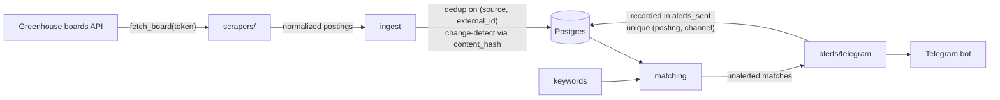

# jobwatch

A backend service that watches company career pages, stores postings in Postgres, dedupes them, and sends a Telegram alert the moment a new posting matches your criteria (e.g. *Amsterdam* + *intern / software engineer*).

Built as a real, running service — not a one-weekend script: proper schema with migrations, idempotent ingestion and alerting, tested failure paths, containerized.

## Architecture



**Schema** (Alembic-managed): `sources` (which boards to poll), `postings` (deduped jobs, raw JSON kept), `keywords` (match terms per field), `alerts_sent` (delivery ledger — the unique `(posting_id, channel)` constraint is what makes alerting exactly-once).

**Idempotency, in three layers**
1. *Ingestion*: a posting's identity is `(source_id, external_id)`; re-fetching the same board is a no-op, edits are detected via a SHA-256 `content_hash` and updated in place.
2. *Alerting*: a posting is alerted at most once per channel, enforced by the DB, not by application memory.
3. *Failures*: a failed Telegram delivery records nothing, so it retries next run; a failing board doesn't take down the rest of the run.

## Quickstart

Requirements: Python 3.11+, Postgres (Docker: `docker compose up -d db`).

```bash
python -m venv .venv && source .venv/bin/activate   # Windows: .venv\Scripts\activate
pip install -e ".[dev]"
cp .env.example .env                                 # fill in DB URL + Telegram creds

alembic upgrade head                                 # create the schema

jobwatch add-source --ats greenhouse --token adyen --name Adyen
jobwatch add-keyword --field title intern "software engineer" backend
jobwatch add-keyword --field location amsterdam

jobwatch seed        # ingest the current backlog silently (no alert flood)
jobwatch run         # one pass; --loop to poll every POLL_INTERVAL_SECONDS
jobwatch status      # row counts + pending alerts
jobwatch serve       # web dashboard + JSON API at http://127.0.0.1:8000
```

Any Greenhouse- or Lever-hosted company works with the same two scrapers — the board token is the slug in `boards.greenhouse.io/<token>` or `jobs.lever.co/<token>`. Verified boards with an Amsterdam/NL presence:

| Company | Command |
|---|---|
| Adyen | `jobwatch add-source --ats greenhouse --token adyen --name Adyen` |
| IMC Trading | `jobwatch add-source --ats greenhouse --token imc --name "IMC Trading"` |
| Databricks | `jobwatch add-source --ats greenhouse --token databricks --name Databricks` |
| Elastic | `jobwatch add-source --ats greenhouse --token elastic --name Elastic` |
| Flexport | `jobwatch add-source --ats greenhouse --token flexport --name Flexport` |
| Catawiki | `jobwatch add-source --ats greenhouse --token catawiki --name Catawiki` |
| Bird | `jobwatch add-source --ats greenhouse --token bird --name Bird` |
| Mendix | `jobwatch add-source --ats lever --token mendix --name Mendix` |

## Telegram setup

1. Create a bot with [@BotFather](https://t.me/BotFather) → copy the token into `TELEGRAM_BOT_TOKEN`.
2. Send your bot any message, then open `https://api.telegram.org/bot<TOKEN>/getUpdates` and copy `chat.id` into `TELEGRAM_CHAT_ID`.

Without credentials the pipeline still ingests; it just skips the alert phase.

## Dashboard & API

`jobwatch serve` runs a FastAPI app over the same database:

- `/` — HTML dashboard: stats, latest postings, matches highlighted (`/?matched_only=true` to filter)
- `/api/postings` — JSON, with `?limit=`, `?q=<title search>`, `?matched_only=true`
- `/api/stats` — row counts and pending-alert count
- `/api/health` — liveness probe

## Tests

```bash
pytest
```

Covers the dedup contract (same batch twice → zero inserts), edit detection, keyword matching, Greenhouse normalization against a mocked API, and end-to-end pipeline idempotency including failed-delivery retry. Tests run on in-memory SQLite; the schema uses `JSONB` on Postgres via a type variant.

## Deployment (Railway / Fly.io)

The container migrates and then polls: `alembic upgrade head && jobwatch run --loop`.

- **Railway**: create a project from this repo, add the Postgres plugin (its `DATABASE_URL` is picked up as-is — `postgres://` URLs are normalized automatically), set the Telegram variables.
- **Fly.io**: `fly launch`, attach Postgres, `fly secrets set TELEGRAM_BOT_TOKEN=... TELEGRAM_CHAT_ID=...`.
- Alternatively run `jobwatch run` (no `--loop`) from a platform cron/scheduled job.

## Roadmap

- [x] Second ATS type — Lever (`api.lever.co/v0/postings/<company>`: bare array, epoch-ms timestamps)
- [ ] Recruitee (`<company>.recruitee.com/api/offers`) — the ATS many Dutch scale-ups use
- [ ] Queue-backed workers (Redis + RQ/Celery) so each source is an independent job
- [ ] Email as a second alert channel
- [x] Small web dashboard + JSON API over the postings table (FastAPI, `jobwatch serve`)
- [ ] Whole-word keyword matching option ("intern" currently also hits "Internal")
